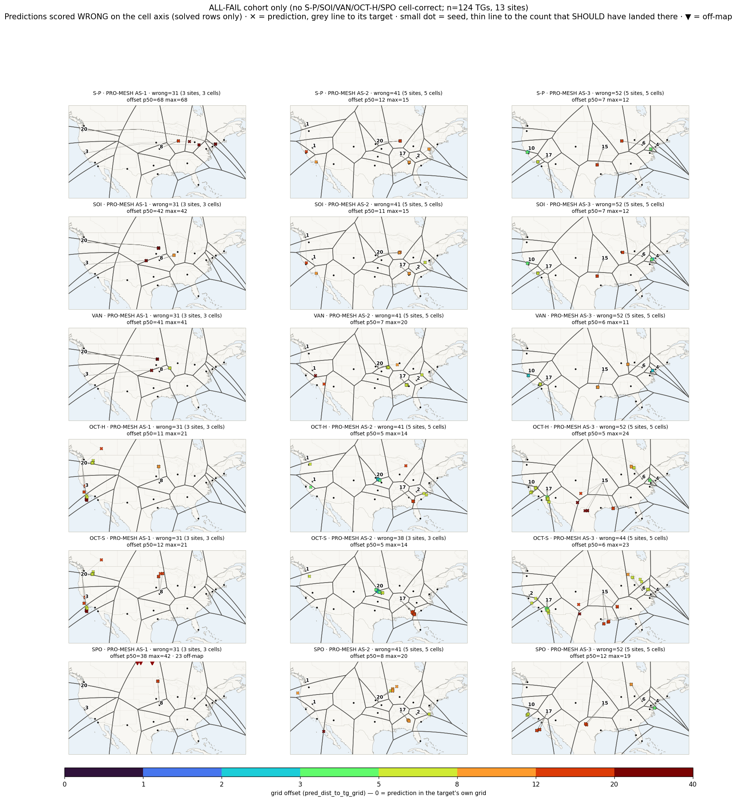

# The all-fail cohort: wrong labels, or locations RTT cannot see?

**Date:** 2026-10-04
**Data:** pro-as01/02/03 meshes, `outputs/analysis/v5/<run>/classify/healpix-128/*_tgs.parquet`,
edge CSVs `datasets/final/as0*-20260728-20260802.mainland.sanitized.csv`,
PNI lists `datasets/pni/as0*-us-pni.approx.csv`, fold checkpoints
`outputs/benchmark/v2/<run>/generic_csv/anchors_to_probes/fold_*/<combo>/fit_checkpoint.pkl`
**Assets:** [assets/2026-10-04-allfail-cohort/](assets/2026-10-04-allfail-cohort/)
(scripts, figures; the CSVs are gitignored and regenerate from the scripts)
**LOSO arm:** `configs/pro-as0{1,2,3}-loso.yaml`, `report-loso-delta` (§6)
**Cohort list:** `outputs/analysis/v5/_cross/classify/3-runs-379a99/allfail_cohort.csv`
(124 rows; `group` = `interconnect_no_x` / `flat_63ms_unlocatable`)
**Companion:** `report-sp-pni-cells` (`scripts/analysis/v5/modules/sp_pni_cells.py`), the has-X / no-X split.

## Question

On the cell axis, some TGs are wrong for **every** method. Are these
ground-truth labelling errors, or targets whose location the RTTs cannot
reveal? And why do OCT-H/OCT-S and SPO put them somewhere different from S-P?

## Answer

**The labels are consistent with the RTTs. But from RTTs alone the claimed
location can't be identified, only bounded.** The cohort splits into two
groups:

| group | share of TGs | what RTT says about the label |
|---|---|---|
| interconnect (no-X) sites | ~8% (101 TGs, 11 sites) | *consistent, not identifiable.* The RTT field peaks at the ingress interconnect X, not at the target. The label passes every physical check, but so does a ring of radius ~RTT·100 km around X. |
| AS-1 Hillsboro + 3 San Jose replicas | 1.8% (23 TGs) | *neither confirmed nor refuted.* Every VP sees ≥63 ms, so no mainland location fits better than any other. Label-suspect: the other 17 San Jose replicas, at the same coordinate, see 2.3 ms. |

No method recovers the label from RTT. OCT-H gets closest, and part of that
comes from the label leaking through same-site replicas in calibration, not
from RTT.

## 1. Who they are

`allfail.py`. A TG is in the cohort when none of S-P, SOI, VAN, OCT-H, SPO
(the champion-UpSet set) is `cell_label == correct`.

- 124 of 1,269 TGs (9.8%), 13 of 65 sites. By run: AS-1 31/399, AS-2 41/412, AS-3 52/458.
- None of them is `unanswered`. Every method answered, and answered wrong.
  The best method's error has a median of 316 km (p10 115, p90 682).
- **121/124 are in TG cells that do not hold X**, i.e. `pni_gap` cluster C2.
  The 3 has-X ones are the San Jose (C3) replicas below.

Note: the champion UpSet (`figure_champion_upset.py`) *cannot* show this
cohort. A champion is defined relative to the best error on that TG, so every
TG has one (`n_no_champion == 0` in every manifest).

## 2. Is there a consistent alternative location?

`gt_check.py`.

- **Across replicas:** at every site, all failing replicas sit within 100 km
  of one site-level consensus point. Here the consensus point is the medoid
  of the methods' predictions.
- **Across methods:** typically 2–4 of the 5 predictions agree within 100 km.
- **Where:** at 9 of 13 sites the consensus is 18–45 km from one of the AS's
  interconnects. Council Bluffs→Chicago, Clarksville→Atlanta, Las Vegas and
  Reno→LA, Kansas City (AS-3)→Dallas, Sacramento→San Jose area,
  Pittsburgh→Chicago.

The outcome maps restricted to the cohort show it:

`allfail_outcome_map.py` reuses `figure_outcome_map.render` on filtered
frames. The `correct` map is empty for every row except OCT-S (3 TGs on AS-2,
8 at Sacramento on AS-3), because OCT-S is not part of the cohort definition.

## 3. Is the label wrong? The RTT tests

- **Feasibility.** At 2/3 c (RTT floor = d/100 ms), no measured RTT rules
  out the label, on any of the 124 TGs. The tightest edge still has ≥3.5 ms
  of slack.
- **The consensus point is not where the target sits.** A VP within 50 km of
  a correctly located target sees **2.4 ms** (median, rest of the pool). VPs
  within 50 km of the consensus point see **7–14 ms**, which is at or above
  the 2/3 c floor from the consensus back to the label:

  | site → consensus | RTT at consensus | floor consensus→label |
  |---|---|---|
  | Council Bluffs → Chicago | 10.5 ms | 6.6 ms |
  | Clarksville → Atlanta | 7.9 | 4.0 |
  | Las Vegas → LA | 9.4 | 3.7 |
  | Kansas City → Dallas | 10.5 | 6.9 |
  | Sacramento → San Jose area | 7.6 | 1.3 |

  So "target at the label, traffic turning at X" fits. "Target at X" would
  need a 5–8 ms access delay that also happens to grow with distance to the
  labelled site. RTT alone cannot fully exclude that; a traceroute would.
- **Partly failing sites do not vouch for the label.** Their "passing"
  replicas share the same faraway consensus and pass only because a single
  method happens to land in the cell. San Jose is the exception.
- **Hillsboro + 3 San Jose.** Methods spread ~1,800 km, every VP sees
  ≥63 ms, the RTT barely changes across the continent (p90 − min = 18 ms),
  and the lowest-RTT VP is ~3,900 km away in the east. No mainland position
  fits: wherever the target sat, at least one of the 134 VPs would see well
  under 63 ms. This matches the AS-1 East-coast detour.

### Why "consistent but not identifiable"

When traffic enters at X, every VP's RTT is roughly
RTT(VP→X) + RTT(X→target). The VP-side term is minimised at X, so any
estimator that maps low RTT to proximity is pulled to X. The target-side
term is a single number. Even knowing X, it bounds the target to a ring around
X (Council Bluffs: ≤~1,000 km from Chicago at 10.5 ms), not a point. The
measurements carry the label as one point inside a large feasible region and
nothing more.

## 4. Why OCT-H/OCT-S and SPO land elsewhere

`mech_test.py` replays each fold's checkpoint through `CBGModel` with the
parquet's per-target seed. The replay matches the published predictions to
0 km on all 124 TGs, then the experiments vary one thing.

### OCT-H: per-VP memory admits the label, but the bands are too wide

`bounded_spline` fits a hull **per VP**. Replicas span folds, so each test TG
has 7–17 replicas of its own site (median 15) in that VP's training data.
Leave-site-out (LSO) refits without them:

| | interconnect sites | Hillsboro + SJ |
|---|---|---|
| VP annuli admitting the label, full | 97% | 92% |
| same, LSO | 84% | **38%** |
| VP annuli admitting the consensus (X), full | 79% | 9% |
| median error full → LSO | 363 → **545 km** (worse on 81%) | 360 → 271 km |

- **The memory is real.** For the 63 ms group, the annuli include the true
  distance almost only because the site's replicas taught each VP
  "63 ms ↔ Hillsboro". At interconnect sites, LSO makes 81% of the errors
  worse.
- **It does not place the target.** A 5 ms bin hull covers every training
  target at that RTT, so it admits X too (79%). The highest-weight face's
  medoid lands ~360 km off: memory steers toward the label, not into its cell.
- **Without the replicas, OCT-H does not fall back to X** (only 19% of
  predictions move toward the consensus point). Its separation from S-P is
  annulus geometry, not memory.
- **Hillsboro's West-Coast placement is not memorization**: LSO lands closer.
  Not yet explained.

### SPO: least squares on one shared curve, not a robust vote

`gaussian_density` multiplies per-VP Gaussians, so `argmax = argmin Σ zᵢ²`
with `zᵢ = (sᵢ − μᵢ)/σᵢ`. That is least squares, not the mode of a sum of
densities. `normal_dist` fits **one** μ(RTT), σ(RTT) for all VPs, so there is
nothing per-VP to memorize.

| | interconnect sites | Hillsboro + SJ |
|---|---|---|
| μ ± σ for the lowest-RTT VP | 425 ± 172 km | 2,950 ± 1,100 km |
| Σz² at SPO / label / consensus | 62 / 144 / 114 | **9** / 112 / 222 |
| SPO answer → nearest VP | 232 km | 2,193 km |
| share of Σz² at the label from the top 10% VPs | 44% | 48% |

- **It is a real best fit, not a search miss**: SPO's answer fits its own
  model better than the label does.
- **Interconnect sites:** the shared curve says even the closest VP is
  ~425 km away, so SPO places the target ~μ from every VP at once. That is
  ~380 km from X and ~575 km from the label; it does not snap onto X the way
  S-P does.
- **Hillsboro:** every VP "agrees" the target is ~3,000 km away. The only
  such points lie outside the area the VPs cover, so SPO goes into Canada
  (23 off-map carets on the outcome map). The fit there is almost perfect
  (median |z| 0.21). The VPs agree; they just agree on a distance curve with
  no detour in it.
- **Not outlier-robust**: about 45% of the misfit at the label comes from 10%
  of the VPs. The real failure here isn't outliers, though. It is that the
  shared curve has no term for RTT inflation.

## 5. The mirror image: OCT-only successes are mostly memorized labels

If OCT memorizes, its *unique* wins are suspect too. Cohort: OCT-H or OCT-S
cell-correct and none of S-P/SOI/VAN/SPO. That is 153 TGs (12% of the pool)
at 15 sites, and **151 are no-X (C2)**: the same kind of target as §3.

**Leave-site-out** (`lso_oct.py`). Both Octant variants are replayed from the
fold checkpoints (0 km deviation; the replay's cell label matches the
published one on every row), then refit without the target's own site.
Control: 120 TGs (40 per run) where OCT-H and some other method are both
correct.

| cohort | method | published correct | still correct under LSO | median error full → LSO |
|---|---|---|---|---|
| OCT-only | OCT-H | 142 | **25%** | 129 → 378 km |
| OCT-only | OCT-S | 98 | **37%** | 191 → 334 km |
| control | OCT-H | 120 | 83% | 7 → 54 km |
| control | OCT-S | 109 | 88% | 6 → 61 km |

Only 30% of OCT-only TGs keep any Octant success under LSO. What survives is
mostly whole sites: AS-2 Lincoln NE (20/20, ~47 km error either way) and
AS-3 Philadelphia (7/7), with San Diego (4) and the 2 flat San Jose replicas
for OCT-H only. Everywhere else, the win needs the site's own replicas in
calibration.

**Label plausibility, independent of OCT** (`octonly_label_check.py`;
consensus = medoid of S-P/SOI/VAN/SPO):

| | OCT-only | control |
|---|---|---|
| min RTT, median | 12.7 ms | 1.7 ms |
| non-OCT consensus → nearest PNI | 36 km | 24 km |
| non-OCT consensus → label | 602 km | 48 km |
| labels passing 2/3 c | 100% | 100% |
| RTT at consensus ≥ floor back to label | 100% (119 with a VP within 50 km) | — |

The same signature as §3: traffic turning at an interconnect, with the label
consistent with that but not identifiable. Two more San Jose replicas have the
flat ~63 ms profile (OCT-only wins), which makes the flat San Jose group 5,
not 3.

**Reading.** OCT reproduces whatever label the replicas carry. Its unique
wins are therefore evidence neither of RTT inference nor of label
correctness. The RTT checks say the labels are plausible but unverifiable,
so the right word is *propagated*, not *wrong*. The full leave-one-site-out
benchmark (§6) measures what this costs.

## 6. Measured: the leave-one-site-out benchmark

`configs/pro-as0{1,2,3}-loso.yaml` are the mesh configs with
`source_kwargs.fold_by: site` and k = 20 / 22 / 23 sites, so every fold holds
out one whole site and calibrates on the rest. Compared with
`report-loso-delta` (output `outputs/analysis/v5/_cross/loso-delta/6-runs-197fee/`).

**Checks.**
- `audit_loso_splits.py`: every fold's eval set is one whole site, its fit
  rows are exactly the other sites' CSV rows, and every site is held out once.
- S-P and SOI predictions are identical to the mesh runs (the report enforces
  this).
- On the AS-1 TGs shared with §5's per-target refits, the LOSO run's cell
  labels match the refits on 88/88 rows.

**Pooled, three meshes.** Cell accuracy (95% CI from the paired site
bootstrap), and error p50 on solved rows:

| method | cell acc K-fold → LOSO | Δ (CI) | p50 K-fold → LOSO | unanswered |
|---|---|---|---|---|
| S-P | 49.2% → 49.2% | 0 | 116 → 116 km | 0 |
| SOI | 50.1% → 50.1% | 0 | 96 → 96 km | 0 |
| VAN | 57.0% → 55.4% | −1.6 pp (−4.9, +0.2) | 199 → 284 km | 21.7% → **40.7%** |
| OCT-H | **73.5% → 57.8%** | **−15.8 pp (−24.3, −7.8)** | **33 → 118 km** | 0 |
| OCT-S | 69.1% → 60.2% | −8.9 pp (−16.5, −2.5) | 37 → 129 km | 0 |
| SPO | 63.7% → 61.8% | −1.9 pp (−5.2, 0) | 243 → 243 km | 0 |

The §5 extrapolation for OCT-H (~55%) was close. Per mesh, OCT-H drops
−9.0 / −19.9 / −17.9 pp (AS-1 / AS-2 / AS-3); only AS-1's CI includes 0.

**has-X vs no-X** (`tg_cell_holds_x`), pooled:

| method | has-X acc | has-X p50 | no-X acc | no-X p50 |
|---|---|---|---|---|
| S-P | 93.3% → 93.3% | 27 → 27 km | 0.2% → 0.2% | 601 km |
| SOI | 93.3% → 93.3% | 25 → 25 km | 2.2% → 2.2% | 474 km |
| OCT-H | 94.8% → 90.4% | **4 → 42 km** | **49.9% → 21.5%** (−28.5 pp, CI −44.6, −14.9) | 261 → 406 km |
| OCT-S | 94.8% → 93.1% | 4 → 61 km | 40.6% → 23.6% | 352 → 441 km |
| SPO | 84.3% → 81.6% | 162 → 174 km | 40.8% → 39.8% | 548 → 575 km |

**By distance to the nearest other site** (OCT-H): no change in the cell when
a same-metro site (<50 km) stays in training (100% → 100%; p50 still rises
5 → 35 km). The losses are where the nearest training site is far: −20 pp at
200–400 km and −25 pp at ≥400 km.

**Reading.**
1. **Most of OCT-H's lead over S-P/SOI on no-X targets was memorization.**
   Under LOSO it keeps 21.5% there, against S-P/SOI's 0–2%, so a real
   geometric gain remains. It is about 40% of the K-fold gain.
2. **The sub-10 km precision on has-X targets was memorization too.** OCT-H's
   has-X p50 goes from 4 to 42 km, worse than SOI's 25 km. Cell accuracy
   barely moves, because the cells are large.
3. **The ranking changes.**
   - Cell accuracy: OCT-H drops from first to third, behind SPO (61.8%) and
     OCT-S (60.2%). The three are within 4 pp; separability is not tested.
   - Pooled p50: SOI is best (96 km), then S-P (116 km) and OCT-H (118 km).
4. **VAN loses answers, not accuracy.** It refuses twice as often without
   the site, so a LOSO "VAN accuracy" is mostly a refusal story.
5. **SPO barely moves**, as expected of a single pooled μ/σ curve: removing
   one site out of ~20 hardly changes it.

## Consequences

- Cite the cohort as *label propagation failing on no-X targets*, not as
  mislabelling. It is the extreme end of the §5 has-X → correct / no-X → wrong
  expectation and needs no per-method explanation.
- Run the ranking as a sensitivity check without Hillsboro + 3 San Jose
  (1.8%). If it matters, ask the operator about those IPs.
- OCT-H's edge on these targets is partly replica leakage across folds,
  consistent with the benchmark-scope note (replicas span folds on purpose;
  leave-site-out is future work).
- OCT's unique wins (12% of TGs) are ~70% replica memorization (§5). Under
  leave-one-site-out (§6), OCT-H's pooled cell accuracy falls 73.5% → 57.8%
  and its p50 rises 33 → 118 km; SOI has the best LOSO p50. Report the
  K-fold numbers as *seen-site* (label propagation) and the LOSO numbers as
  *unseen-site*, and say which one a claim rests on.
- Paper rule: percentages only. The counts above are for this note.

## Open

- Separability of SPO / OCT-S / OCT-H under LOSO (paired site bootstrap
  between methods, as in the champion analyses).
- LOSO for the traffic-weighted arms (`fold_by` is wired through
  `traffic_weighted_csv`; a site whose flows are all filtered out makes its
  fold refuse).
- Why Lincoln NE and Philadelphia survive LSO.

- What pulls OCT-H's Hillsboro predictions to the West Coast under LSO.
- Whether an additive (mixture) SPO would differ. Probably not for
  Hillsboro, where every VP agrees.
- A `--tg-ids` filter on `plot-outcome-map`, if the cohort maps become a paper figure.
